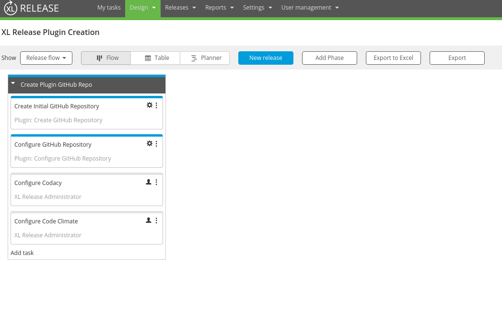
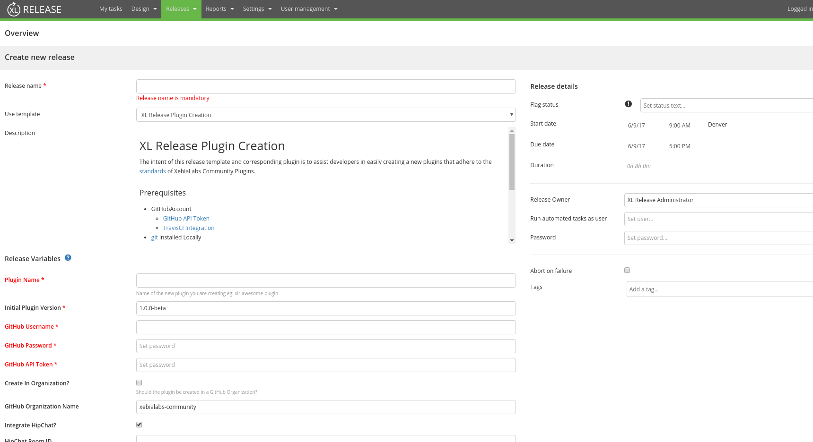

# xlr-plugin-plugin

[![License: MIT][xlr-plugin-plugin-license-image] ][xlr-plugin-plugin-license-url]
[![Github All Releases][xlr-plugin-plugin-downloads-image]]()

[xlr-plugin-plugin-license-image]: https://img.shields.io/badge/License-MIT-yellow.svg
[xlr-plugin-plugin-license-url]: https://opensource.org/licenses/MIT
[xlr-plugin-plugin-downloads-image]: https://img.shields.io/github/downloads/xebialabs-community/xlr-plugin-plugin/total.svg

## Preface
This document describes the functionality provided by the `xlr-plugin-plugin`

## Overview
The intent of this plugin and corresponding release template is to assist developers in easily creating a new plugins that adhere to the [standards](http://xebialabs-community.github.io/) of XebiaLabs Community Plugins.

## Installation
Copy the plugin JAR file into the `SERVER_HOME/plugins` directory of XL Release.

## Usage
Utilize the template provided with the release and follow the instructions in the template to create your new plugin.

### Prerequisites
* GitHubAccount
  - [GitHub API Token](https://help.github.com/articles/creating-a-personal-access-token-for-the-command-line/)
  - [TravisCI Integration](https://docs.travis-ci.com/user/getting-started/)
* [git](https://git-scm.com/) Installed Locally
* [Travis CI Command Line Interface](https://github.com/travis-ci/travis.rb) Installed Locally
* [Gradle](https://gradle.org/) Installed Locally

### Optional
* GitHub Organization
  - If you wish to create your plugin within an organization ([xebialabs-community](https://github.com/orgs/xebialabs-community)) you need to have the appropriate access to do so.
* HipChat
  - API Token For HipChat Notifications
  - HipChat Room ID
