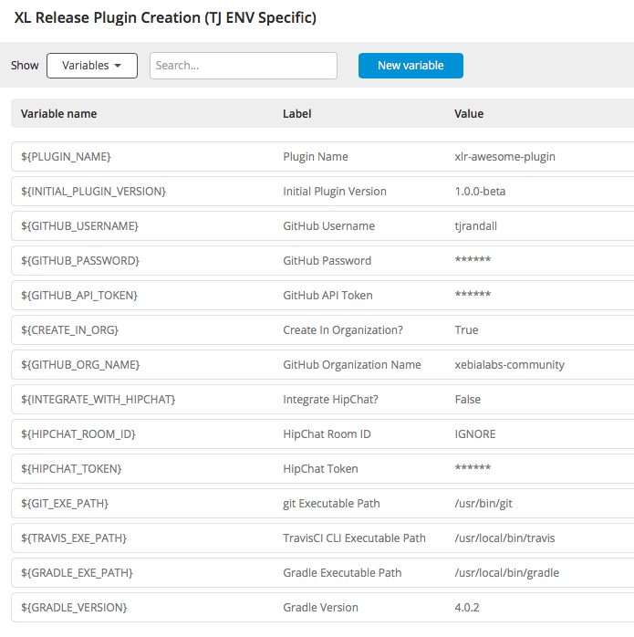

# xlr-plugin-plugin

[![License: MIT][xlr-plugin-plugin-license-image] ][xlr-plugin-plugin-license-url]
[![Github All Releases][xlr-plugin-plugin-downloads-image]]()

[xlr-plugin-plugin-license-image]: https://img.shields.io/badge/License-MIT-yellow.svg
[xlr-plugin-plugin-license-url]: https://opensource.org/licenses/MIT
[xlr-plugin-plugin-downloads-image]: https://img.shields.io/github/downloads/xebialabs-community/xlr-plugin-plugin/total.svg

## Preface
This document describes the functionality provided by the `xlr-plugin-plugin`

## Overview
The intent of this plugin and corresponding release template is to assist developers in easily creating new XL Deploy and/or XL Release plugins that adhere to the [standards](http://xebialabs-community.github.io/) of XebiaLabs Community Plugins.

This plugin runs on your local installation of XL Release, and has all of the hooks to set up the basic requirements for a Xebialabs community plugin.

Once run, you will have the XebiaLabs community plugin framework set up, and a working project in which you can add your plugin source code.

## Installation
#### Prerequisites
* GitHubAccount
  - [GitHub API Token](https://help.github.com/articles/creating-a-personal-access-token-for-the-command-line/)
  - [TravisCI Integration](https://docs.travis-ci.com/user/getting-started/)
* [git](https://git-scm.com/) Installed Locally
* [Travis CI Command Line Interface](https://github.com/travis-ci/travis.rb) Installed Locally
* [Gradle](https://gradle.org/) Installed Locally

#### Optional
* GitHub Organization
  - If you wish to create your plugin within an organization ([xebialabs-community](https://github.com/orgs/xebialabs-community)) you need to have the appropriate access to do so.
* HipChat *(optional)*
  - API Token For HipChat Notifications
  - HipChat Room ID
  
### One time pre-work
The following initial setup must be done locally on your XL Release instance before you are able to run the plugin creation release:

1. Sign into [Github via TravisCI](https://travis-ci.org/auth)
2. Sign into [Github via Codacy](https://www.codacy.com/login)
3. Install Travis CI locally (Using Ruby: `gem install travis -v 1.8.8 --no-rdoc --no-ri` )
4. Verify git and gradle installed locally.
5. Run travis command in terminal, to ensure XLr task can execute proper travis commands:  `travis login`
6. Download both the plugin JAR file, and XLr template, from the [Project Releases tab](https://github.com/xebialabs-community/xlr-plugin-plugin/releases)
7. Install the xlr-plugin-plugin to the `SERVER_HOME/plugins` directory of XL Release.
8. Import the template into XL Release.  
9. *(optional)* Open the template,  and fill in your user/environment specific values. 


 
## Usage
Utilize the template provided with the release and follow the instructions in the template to create your new plugin.

1.	Run the release from the XLr template 

2. Once the "Configure Github Repository" task has completed, clone the project locally from GitHub. Mark task complete.

3.	For Codacy task, read the task description and follow steps. Mark task complete.
   
4.	For Code Climate task, read the task description and follow the steps. Mark task complete.
	
5.	Once all tasks are completed, verify you have a valid xebialabs-community project on Github.   

Now you have the framework for creating your plugin. Add your source code, and create a good readme for other users to follow.

## Plugin License Information
Travis checks to ensure that all scripts, synthetic.xml and xl-rules.xml have the proper license header in each file.  Please refer to the [License to be used](http://xebialabs-community.github.io/) section to ensure your files contain the proper header.

## Creating Plugin via Travis Build
For each version of the plugin that you want to build a release JAR file, you need to do the following:

1. Modify `plugin_source_dir/.travis.yml` – change to correct version
2. Modify `plugin_source_dir>/build.gradle` – change to correct version
3. `git add <your files you want to commit>`
4. `git tag -a <your version id> -m "Version <your version id>"`   (ex/  `git tag -a 1.0.1 -m "Version 1.0.1"`)
5. `git commit -m "a great commit message"`
6. `git push --follow-tags`

Travis CI will then build your plugin, and you will get a plugin built under the ‘Releases’ tab once the job is successful.
